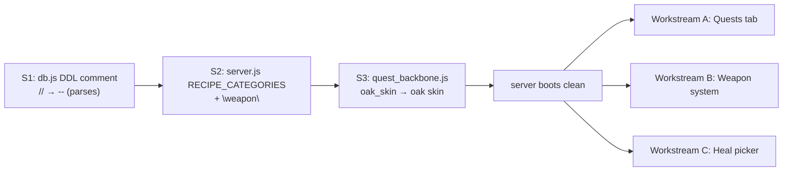
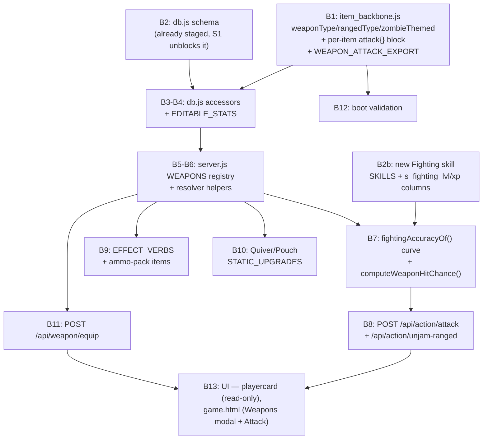

# Handoff: Quests Tab, Weapon System, Healing Touch Picker, CLAUDE.md Process

> **How this document was produced.** This plan was built in a separate remote planning session, working against a **remote clone of the repo** that may lag behind your local working tree — every uncommitted edit the user has made locally is not guaranteed to be reflected here. One concrete example already caught: `WEAPON_ATTACK_EXPORT` (referenced throughout Workstream B) does not exist in the remote clone at all — it's described here purely from the user's own description, not read from source. **Before implementing anything, re-verify every file/line reference below against your actual local working tree.** Treat line numbers as "as of last remote read," not ground truth — re-grep/re-read the real file before editing it. If something described here (a function, a field, a table) doesn't match what you find locally, trust the local code and flag the mismatch rather than forcing the plan's description to fit.
>
> **How to use this document.** Work through workstreams in the order given in "Recommended build sequence" near the end. Each workstream section is close to self-contained — read the whole thing before touching code, since later bullets sometimes depend on earlier ones within the same section. Run `npm run smoketest` after each workstream, not just at the very end, so a regression is traceable to the change that caused it.

## Context

The user has been hand-editing `quest_backbone.js`, `item_backbone.js`, `db.js`, and `config.js` directly (uncommitted, live-in-progress) to scaffold three things: richer quest metadata (`quest_level`, `long_desc`, quest lines), a full players-table redesign for a five-slot "weapon wheel" (guns stay in the backpack; `equipped_gun`/`equipped_melee`/`equipped_ranged`/`equipped_throwing`/`equipped_zombie_weapon` are independent, simultaneously-equipped combat slots — the player *equips into* each slot ahead of time, same as guns, then fires whichever slot they want), and per-weapon-category condition/ammo columns. None of the weapon system was wired into `server.js` as of the remote read — the item registry additions carried zero mechanical fields (no damage/accuracy/ammo-item), and `db.js`/`server.js` had no weapon-system code at all (`WEAPON_TYPES`/`WEAPON_RANGED_TYPES` were exported from `item_backbone.js` but grep confirmed zero references anywhere else at that point). The ask is to finish wiring all of it: a new Quests tab on `public/playercard.html`, quest-level gating in the quest engine, a working weapon combat/equip system end-to-end, a target-picker for the "Healing Touch" spell (server side already fully supports an optional heal target — only the client never sends one, confirmed live on the deployed server: casting it never prompts for a target), and documentation of two new gitignored "semi-static" planning-notes files the user wants checked at the start of every future plan.

**Explicitly out of scope this session** (per the user, to be designed in a follow-up plan): zombies being drawn from a location-level pool, a per-player `zombies_near` tracked-encounter model, and zombies carrying their own HP pool. Today a successful hit still **instakills** its target count outright (same model guns and attack spells already use) — nothing in this plan should assume zombies have HP. The new `attack.dmg` field on weapon items (see B1) is groundwork for that follow-up — it's boot-validated as data but **not consumed by any combat math yet**.

**Three boot-blocking bugs must be fixed first, before anything else, or nothing in this plan is testable.**

## STOP-SHIP fixes (do first)

- **S1 — `db.js`, inside the `CREATE TABLE players (...)` DDL, near the equipped-weapon columns.** A `// Playercard Equipped Weapons` JS-style comment sits inside the raw SQL template literal (the whole DDL block is one `db.exec(...)` call). SQLite only understands `--`/`/* */` comments, so `db.exec()` throws at import time — **the server cannot boot at all** with this in place, nor can `_smoketest.mjs` or the CLI. Fix: change `//` to `--` (match the surrounding `-- -` heading convention already used elsewhere in that block). Search for `Playercard Equipped Weapons` to find it.
- **S2 — `server.js`, the `RECIPE_CATEGORIES` array in the boot-validation section.** As last read it was `["food", "potion", "base", "magic", "metal", "misc"]` — missing `"weapon"`. Every weapon-crafting recipe in `item_backbone.js` (`craft_baseball_bat` through `craft_zombie_spine_whip`, ~24 rows, all `category: "weapon"`) fails the boot-validation check the moment S1 is fixed. Fix: add `"weapon"` to the array.
- **S3 (found during remote verification, not something the user flagged) — `quest_backbone.js`, the `basic_training_3` quest.** Its `learn_spell` objective was `{ type: "learn_spell", spell: "oak_skin", qty: 1 }`, but `magic.js`'s actual key is `"oak skin"` (a space, not an underscore). `server.js`'s quest-registry boot validation (`if (obj.type === "learn_spell") { if (!MAGIC_SPELLS[obj.spell]) bad.push(...) }`) will FATAL on this the moment S1/S2 are fixed and boot actually reaches that check. Fix: change `spell: "oak_skin"` → `spell: "oak skin"` in `quest_backbone.js`. (Every other spell reference in the file — `"teleport"`, `"fireball"`, `"heal"` — was cross-checked against `magic.js` keys and is correct; this is the only mismatch found.)



## Data-integrity fixes in `item_backbone.js` (do before any weapon wiring)

Every `category: "weapon"` recipe's `output`/`inputs` was cross-checked line-by-line against the live `ITEMS` keys as of the remote read. Re-verify each row still matches before fixing — the user may have already fixed some of these locally. Fix whichever of these are still present, as one pass:

| Recipe | Problem | Fix |
|---|---|---|
| `craft_billyclub` | outputs `"Billy Club"`, item key/name is `"Billyclub"` | rename the ITEMS key **and** `name` to `"Billy Club"` |
| `craft_zombie_club` | outputs `"Zombie Club"` — item doesn't exist | add new ITEMS row, key `"zombie club"`, `type:"weapon"`, `section:"Melee"`, zombie-flavored desc |
| `craft_zombie_dagger` | outputs `"Zombie Dagger"` — item doesn't exist | add new ITEMS row, key `"zombie dagger"`, `type:"weapon"`, `section:"Melee"`, zombie-flavored desc |
| `craft_zombie_flail` | outputs `"Zombie Flail"` (Title Case) vs key `"zombie flail"` | lowercase the recipe's `output` |
| `craft_zombie_crossbow` | outputs `"Zombie Crossbow"` vs key `"zombie crossbow"` | lowercase `output` |
| `craft_zombie_bow` | outputs `"Zombie Bow"` vs key `"zombie bow"` | lowercase `output` |
| `craft_zombie_throwing_knives` | outputs `"Zombie Throwing Knives"` vs key `"zombie throwing knives"` | lowercase `output` |
| `craft_zombie_spiked_knuckles` | outputs `"Zombie Spiked Knuckles"` — no such item | change `output` → `"zombie knuckles"` |
| `craft_zombie_arm` | outputs `"Zombie Arm"` — **the ITEMS key `"zombie arm"` is defined twice** in the same `ITEMS` object literal (once as the Fist weapon, once as a plain crafting material named "Zombie Bits") — the later definition wins, so **the weapon item is currently silently deleted by the crafting-material one** | rename the *weapon* entry's key to `"zombie fist arm"` (keep display `name: "Zombie Arm"`); point this recipe's `output` at the new key |
| `craft_zombie_knuckles` | inputs `"zombie teeth": 5` (no such ITEMS key exists anywhere, as of the remote read) and outputs `"Zombie Knuckles"` (Title Case) | fix input → `"zombie tongue"` (exists); lowercase `output` → `"zombie knuckles"` (now two crafting routes to the same item as `craft_zombie_spiked_knuckles` — intentional, both are valid paths to the same result) |
| `craft_zombie_spine_whip` | inputs `"zombie spine": 5` (no such ITEMS key exists, and would be circular with the weapon's own name) and outputs `"Zombie Spine Whip"` (Title Case) | fix input → `"zombie bone"` (exists); lowercase `output` → `"zombie spine whip"` |

No fix needed for `craft_zombie_sword` (already correct as of the remote read). Not in scope: `"Spiked Bat"`/`"Slingshot"`/`"zombie slingshot"` had no recipe or shop entry (unobtainable) — leave as-is unless flagged later.

Also noticed, not required for this plan, optional cleanup only: `quest_backbone.js`'s `"drop_it"` has a duplicate `starter` key (harmless, second wins) and flavor text copy-pasted from `"resupply"`. The `config.js` `app_version` regression (`2.0.28-dev-rc` → `2.0.27-dev-rc`) is the user's own to fix, not an action item here — a live-server deploy landed before the switch to `2.0.28-dev-rc` and it hasn't been flipped back yet. `quest_backbone.js` also carries a large dead scaffold at the bottom (`QUEST_REWARDS`, `QUEST_REWARD_EXPORTER`, `QUEST_PROGRESS_HOOK`, `QUEST_STARTER_HOOK`) — zero references anywhere in `server.js`/`db.js` as of the remote read; models a different quest engine shape (`player.actionsPerformed`, `player.isNewPlayer`, etc.) than the one actually implemented (`quest_active`/`quest_objectives` columns + `recordQuestProgress`/`checkQuestTriggers`). Not touched by this plan — flagging in case it's leftover from an earlier design pass worth deleting later. `QUEST_NAMES` is imported into `server.js` but never referenced past the import line — also not touched here.

---

## Workstream A — Quests tab (`playercard.html`) + quest-level gating

No changes needed to `quest_backbone.js` beyond S3 above — `quest_level`/`long_desc` already exist in the needed shape; missing values on some entries (e.g. `defense_up` has neither) should be handled by fallback in code (`quest_level` missing = unrestricted, `long_desc` missing = fall back to `desc`), not by editing quest data.

1. **`db.js` — level gate.** In `startQuest(userId, questKey)`, right after the existing player-row fetch and before the `started.includes(questKey)` check: if `quest.quest_level` is set and `player.level < quest.quest_level`, return without starting. `checkQuestTriggers` needs no change — it just calls `startQuest` per match, so the gate is inherited.

2. **`server.js` — re-check on level-up.** `POST /api/level/up` and `/api/level/max` never re-run quest triggers today, so a quest gated on `quest_level` whose *other* starter condition already fired earlier stays stuck. After the `applyLevelUp` call in both handlers (before the `res.json` return), call `checkQuestTriggers(req.userId, { type: "location", location: locationOf(player) })` — catches `enter_location`-gated quests where the player is already standing in the right spot. **Accepted limitation, not fixed**: `{type:"action"}` starters (e.g. `resupply`) aren't recaptured this way — the player has to redo the action after leveling. Out of scope here.

3. **`server.js` — richer payload for the card.** Leave `questsPayloadFor` (used by `/api/game-state`) untouched. Add a second helper, `questsPayloadForCard(player)`, reusing the existing `questObjectiveLabel` helper, returning the same `{active, started, completed}` shape but with `completed` carrying `name`, `long_desc` (fallback `desc`), `quest_level` (fallback `null`), `reward`, and `objectives` as label strings only (no have/need — a completed quest has no live progress). Wire `quests: questsPayloadForCard(player)` into `/api/playercard`'s `Object.assign` block, inside the existing `authenticated` gate, alongside `guns`/`armors`/`spells`.

4. **`public/playercard.html` — the tab.** Add a 5th tab following the exact existing pattern: button (`data-maintab="quests"`) in `#mainTabs`, panel `#mtQuests` beside `#mtSpells`, add `"Quests"` to the tab-click handler's toggle logic. `#mainLoginPrompt`/`#mainAuthedContent` already wraps the whole tab bar including Spells — no new auth-gating pattern needed, just place Quests inside that existing block.

   Layout inside `#mtQuests` — flex column, fixed height (match `#mtSpells`'s `55vh` budget), three children at `flex: 1 1 0`, `flex: 1 1 0`, `flex: 3 1 0` (the **1-1-3** ratio):
   - **Top (1 share):** active quest — name, `desc`, objectives as `${done?"✅":"⬜"} label — have/need` (mirror `game.html`'s `renderQuestInfo()` active-quest block).
   - **Middle (1 share):** started-but-not-active quests — name + desc only, no "Track" button (quest-tracking stays a `game.html`-only action; `playercard.html` has no action endpoints by existing convention).
   - **Bottom (3 shares, own `overflow-y: auto`):** completed quests as accordion rows, collapsed by default — header shows name + compact reward summary; expanding reveals `long_desc`, `quest_level` (or "no level requirement"), full reward breakdown, objective list. Hand-roll the collapse (a `d-none` toggle per row, matching this file's existing zero-JS-framework-component style) rather than pulling in Bootstrap's Accordion component for the first time.

---

## Workstream B — Weapon system

Build in this order: **data fixes → schema (already staged, just fix S1) → db.js accessors → server.js registry/behavior/routes → boot validation → UI (playercard, then game.html)**.



### B1. `item_backbone.js` — new fields
- `WEAPON_TYPES` (as last read: `["handgun","rifle","burstrifle","shotgun","melee","ranged","fist"]`, confirmed unused anywhere in `server.js`/`db.js` at that point) → replace with `["melee","fist","ranged","throwing"]`.
- `WEAPON_RANGED_TYPES` (as last read: `["crossbow","bow","throwing","slingshot"]`) → drop `"throwing"`: `["crossbow","bow","slingshot"]` (throwing is fully independent now, per the live db.js columns).
- Every `type:"weapon"` row gets a `weaponType` (one of the new `WEAPON_TYPES`).
- Every `weaponType:"ranged"` row also gets `rangedType` (one of `WEAPON_RANGED_TYPES`).
- Every zombie-prefixed weapon row gets `zombieThemed: true` (a real flag, not name-string-matching, for identifying zombie-slot-eligible items).
- Every `type:"weapon"` row also gets an **`attack` block**:
  ```js
  attack: { dmg: 12, targets: 1, target_max: 1, acc_model: "player" }
  ```
  - `dmg` — damage per hit. **Not read by any combat code this session** (see the Context callout) — validated at boot (must be a positive number) and carried on the item purely as groundwork for the next session's zombie-HP work.
  - `targets` — guaranteed zombies dropped on a successful hit (the floor of the roll).
  - `target_max` — the most zombies a single successful hit could drop (the ceiling of the roll) — mirrors the existing `shotgunTargets()` scaling shape (min 1, max 5, scaled by accuracy/condition). See B7 for the exact scaling formula.
  - `acc_model` — `"player"` or `"condition"`, the same two modes `GUN_BEHAVIOR` already uses — `"player"` scales off the wielder's *fighting* accuracy (new — see B2b/B7), `"condition"` scales off the weapon's own condition only, ignoring the wielder entirely (mirrors how the Rifle ignores `player.accuracy`).
  - No per-item `floor` — the user wants `floor` **type-scoped, not item-scoped** (see `WEAPON_ATTACK_EXPORT` immediately below), on the reasoning that the accuracy baseline is a property of *how a weapon category is wielded* (a knife swing vs. a bow draw), not of the individual item. **Per the user, this already exists locally as `WEAPON_ATTACK_EXPORT` — confirm its exact current shape before writing new code against it; the shape below is a best guess from the user's description, not read from source.**

- **`WEAPON_ATTACK_EXPORT`** — the user's own addition (not present in the remote clone read for this plan — locate and read it locally before doing anything else in B1/B7), keyed by `weaponType`, reporting the accuracy `floor` per type:
  ```js
  export const WEAPON_ATTACK_EXPORT = {
    melee:    { floor: 20 },
    fist:     { floor: 15 },
    ranged:   { floor: 55 },
    throwing: { floor: 25 },
  };
  ```
  This replaces the old `WEAPON_BEHAVIOR`-table `floor` column entirely — `item_backbone.js` owns it since it's category-level weapon data, the same file that already owns `WEAPON_TYPES`/`WEAPON_RANGED_TYPES`. `server.js` imports it alongside those two. The `floor` values above are placeholders carried over from an earlier draft — **use whatever the user's actual local `WEAPON_ATTACK_EXPORT` contains**, don't overwrite it with these numbers.

### B2. `db.js` — schema
Already fully staged by the user's edits (`equipped_gun/melee/ranged/throwing/zombie_weapon`, `melee_condition`, `ranged_condition/ammo/crossbow_max_ammo/bow_max_ammo/slingshot_max_ammo/cb_jammed`, `throwing_condition/ammo/max_ammo`, `fist_weapon_condition`). No further DDL changes needed beyond the S1 fix. As of the remote read there was no lingering `equipped_weapon` (singular) reference anywhere in `server.js`/`db.js`/`public/*.html` — re-check quickly, but it should be safe.

### B2b. `db.js` — new "Fighting" skill
Non-gun weapon accuracy is driven by a new trainable skill, not the flat `player.accuracy` stat guns use. Follow the exact existing per-skill pattern (see `SKILLS`/`SKILL_NAMES` near the top of `db.js`, and the `defense` entry specifically):
- Add `"fighting"` to `SKILLS` and `"fighting": "Fighting"` to `SKILL_NAMES`.
- Add `s_fighting_lvl INTEGER NOT NULL DEFAULT 1` / `s_fighting_xp INTEGER NOT NULL DEFAULT 0` to the `CREATE TABLE players` DDL, next to the other `s_*` columns (copy the shape from the `s_defense_lvl`/`s_defense_xp` pair) — **this is a manual DDL addition**; the per-skill columns are individually hand-written, not derived from the `SKILLS` array.
- `EDITABLE_STATS` needs no manual addition — it already spreads `s_${s}_lvl`/`s_${s}_xp` for every entry in `SKILLS`, so `fighting` is picked up automatically.
- No new location action is added for training Fighting (unlike Defense's *Train Defense* action) — per the user, XP only comes from landing hits with non-gun weapons (B8).

### B3. `db.js` — new accessor functions
`db.js` deliberately does not import `item_backbone.js` (mirrors how `GUN_TYPES`/armor slot lists are already local consts for the same reason) — these stay registry-agnostic; any "which ITEMS row is this" resolution happens in `server.js`. Add, mirroring the existing gun accessors' shape:
- `adjustWeaponCondition(userId, col, delta)` — `col` whitelisted against `["melee_condition","ranged_condition","throwing_condition","fist_weapon_condition"]`, clamped 0-100. (The irregular `fist_weapon_condition` name is why this can't reuse the gun accessors' column-builder — pass the column in directly.)
- `addRangedAmmo(userId, amount, cap)` — clamps `ranged_ammo` into `[0, cap]`, cap resolved by the caller in server.js.
- `addThrowingAmmo(userId, amount)` — clamps `throwing_ammo` into `[0, player.throwing_max_ammo]` directly (flat single max column, no external cap needed).
- `updateRangedMaxAmmo(userId, rangedType, change)` — `rangedType` whitelisted against a local 3-entry array, column `ranged_${rangedType}_max_ammo`.
- `updateThrowingMaxAmmo(userId, change)`.
- `setRangedJammed(userId, jammed)` — writes `ranged_cb_jammed` (only crossbow jams, no type param needed).
- `clearRangedJam(userId)` — consumes 1 `ranged_ammo` if available to clear the jam, else refuses; returns `{ok, reason}` like the existing `unjamGun`.
- `equipWeaponSlot(userId, slot, itemName)` — `slot` whitelisted against `{melee:"equipped_melee", ranged:"equipped_ranged", throwing:"equipped_throwing", zombie:"equipped_zombie_weapon"}`, mirrors the existing `updatePlayerGun`.

### B4. `db.js` — `EDITABLE_STATS`
Add entries for every new weapon column, same convention as the existing gun entries (e.g. `handgun_condition: { max: 100 }`): `melee_condition: {max:100}`, `ranged_condition: {max:100}`, `ranged_ammo: {}`, `ranged_crossbow_max_ammo: {}`, `ranged_bow_max_ammo: {}`, `ranged_slingshot_max_ammo: {}`, `ranged_cb_jammed: {max:1}`, `throwing_condition: {max:100}`, `throwing_ammo: {}`, `throwing_max_ammo: {}`, `fist_weapon_condition: {max:100}`. No entries needed for `equipped_*` slots (equip goes through dedicated routes, same as armor/gun today).

### B5-B6. `server.js` — imports + derived registry
Import `WEAPON_TYPES`/`WEAPON_RANGED_TYPES`/`WEAPON_ATTACK_EXPORT` from `item_backbone.js` and the new B3 functions from `db.js`. Add:
- `const WEAPONS = Object.fromEntries(Object.entries(ITEMS).filter(([, i]) => i.type === "weapon"));` (mirrors the existing `GUNS`/`ARMORS` derivation pattern).
- `effectiveRangedType(player)` — `ITEMS[player.equipped_ranged]?.rangedType ?? ITEMS[player.equipped_zombie_weapon]?.rangedType ?? null` (fallback chain so Quiver-cap resolution still works when only a zombie-themed ranged weapon is equipped).
- `rangedCapFor(player)` — resolves the matching `ranged_*_max_ammo` column via `effectiveRangedType`, or `player.ranged_ammo` itself as a safe no-op cap when nothing ranged is equipped (keeps the `rangedAmmo` effect verb from ever hard-failing).
- `weaponConditionColFor(item)` — `melee`→`melee_condition`, `fist`→`fist_weapon_condition`, `ranged`→`ranged_condition`, `throwing`→`throwing_condition`.

### B7. `server.js` — fighting-accuracy curve + weapon hit-chance/target-count math
No `WEAPON_BEHAVIOR`-by-type table anymore — per-item `dmg`/`targets`/`target_max`/`acc_model` lives on `ITEMS[name].attack` (B1), and the type-scoped accuracy `floor` lives in `item_backbone.js`'s `WEAPON_ATTACK_EXPORT` (also B1). What's still needed at the `server.js` level is the machinery that combines both + the wielder's Fighting skill into an actual roll, mirroring the existing `computeHitChance`/`shotgunTargets` functions exactly:

```js
// 40% at Fighting level 1, up to a 95% plateau at level 30+ — linear between.
const FIGHTING_ACC_MIN = 40, FIGHTING_ACC_MAX = 95, FIGHTING_ACC_MAX_LEVEL = 30;
function fightingAccuracyOf(player) {
  const t = Math.min(player.s_fighting_lvl - 1, FIGHTING_ACC_MAX_LEVEL - 1) / (FIGHTING_ACC_MAX_LEVEL - 1);
  return Math.round(FIGHTING_ACC_MIN + (FIGHTING_ACC_MAX - FIGHTING_ACC_MIN) * Math.max(0, t));
}

// Same two branches as computeHitChance; floor comes from WEAPON_ATTACK_EXPORT
// keyed by weaponType (not the item), condition is 0-100 — substitute 100 for
// the zombie slot (no tracked condition — see B8).
function computeWeaponHitChance(player, weaponType, attack, condition) {
  const floor = WEAPON_ATTACK_EXPORT[weaponType].floor;
  if (attack.acc_model === "condition")
    return Math.max(5, Math.round(floor * (condition / 100)));
  return Math.max(floor, Math.round(fightingAccuracyOf(player) * (condition / 100)));
}

// Mirrors shotgunTargets()'s shape: targets is the guaranteed floor,
// target_max the ceiling, scaled by fighting accuracy and condition.
function weaponTargetsHit(player, attack, condition) {
  const scaled = attack.targets + (attack.target_max - attack.targets)
    * (fightingAccuracyOf(player) / 100) * (condition / 100);
  return Math.max(attack.targets, Math.min(attack.target_max, Math.round(scaled)));
}
```

These are proposed formulas (explicitly tunable) — they reuse the *existing* gun-accuracy shape verbatim, just swapping `player.accuracy` for the new fighting curve and pulling `floor` from `WEAPON_ATTACK_EXPORT[weaponType]`. See the Open Judgment Calls section for what's confirmed vs. assumed here.

### B8. `server.js` — new route `POST /api/action/attack { slot }`
`slot ∈ {"melee","ranged","throwing","zombie"}`. **Leave `/api/action/shoot` completely untouched** — this is a fully separate route, not a generalization of it. Same guard structure as shoot (zombie-location, hunt-enabled, horde-size), then:
- Resolve the equipped item for `slot` (400 if empty); resolve `weaponType` (+`rangedType` for ranged) and its `attack` block off `ITEMS`.
- **melee/fist**: check the relevant condition column > 0 (409 "broken, repair it" — same message shape as the gun's "Out of ammo"); roll wear (reuse the existing `SHOT_WEAR_CHANCE`/`SHOT_WEAR_AMOUNT` constants); no ammo spend; condition value fed into B7's functions is the live `melee_condition`/`fist_weapon_condition`.
- **ranged**: if `rangedType === "crossbow"`, check `ranged_cb_jammed` first (409, same shape as gun jam); check `ranged_ammo > 0` (409 "Out of ammo — use an ammo pack"); spend 1; roll wear on `ranged_condition`; jam roll only for crossbow; condition value is the live `ranged_condition`.
- **throwing**: check `throwing_ammo > 0`; spend 1; roll wear on `throwing_condition`; never jams; condition value is the live `throwing_condition`.
- **zombie**: resolve the equipped item's own `weaponType`/`attack` block, but skip condition/wear entirely (no column exists, and borrowing another slot's column would corrupt that slot's independent state) — **feed `condition = 100`** into B7's functions for this slot (treated as permanently pristine, since nothing tracks its wear). If its `weaponType` is ranged/throwing, it still spends from the shared `ranged_ammo`/`throwing_ammo` pool (those pools are player-scoped, not slot-scoped, by design — only condition is slot-exempt for this category).
- Hit chance via `computeWeaponHitChance(player, weaponType, item.attack, condition)`; on a hit, kill count via `weaponTargetsHit(player, item.attack, condition)`, then the same shared `resolveKill()` helper shoot and spell-cast already use.
- **On a successful hit only** (not a miss), grant Fighting XP: `addSkillXp(req.userId, "fighting", 10)` — matches the user's "gaining a hit... grants 10xp per-hit" exactly; misses grant nothing (unlike spell casts, which grant Magic XP on a miss too — deliberately different here since the user specified "gaining a hit").

Also add `POST /api/action/unjam-ranged` (no existing spec for this corner — ranged has no clip concept to spend clearing a jam the way guns do): clears `ranged_cb_jammed` by spending 1 `ranged_ammo` if available, else refuses with a message pointing at needing an ammo pack first.

### B9. `server.js` — ammo packs + `EFFECT_VERBS`
Add `weaponCondition` to `EFFECT_VERBS` (currently entirely missing as of the remote read — `"weapon table"`/`"weapon repair kit"` already reference it in their `use` blocks and silently no-op today): restores condition to **every currently-equipped non-gun slot at once** (melee/fist via whichever column is active, ranged, throwing — zombie slot excluded, no column), capped at 100 each. Add `rangedAmmo`/`throwingAmmo` verbs calling the B3 accessors with `rangedCapFor`/the flat throwing max.

New `item_backbone.js` consumables (`section: "Toolbag", toolbag: true`, matching gun oil):
- `"pack of bolts"` — `use: { rangedAmmo: 15 }`, ~35g.
- `"pack of arrows"` — `use: { rangedAmmo: 10 }`, ~25g.
- `"pouch of stones"` — `use: { rangedAmmo: 20 }`, ~45g.
- `"bundle of throwing knives"` — `use: { throwingAmmo: 10 }`, ~30g.

(Values are tunable defaults, not load-bearing.)

### B10. `server.js` — `STATIC_UPGRADES`
Two new `category:"upgrade"` entries, "Quiver Expansion" and "Pouch Expansion" (+3 max per buy, tunable), following the existing entry shape (e.g. `extended_mag`'s `apply: (uid, gun) => ...`): their `apply(uid)` resolves the player's own equipped ranged type via `effectiveRangedType` and calls `updateRangedMaxAmmo`/`updateThrowingMaxAmmo` directly (ignoring the `gun` param the existing upgrade signature passes, since it's irrelevant here).

### B11. `server.js` — equip route
`POST /api/weapon/equip { slot, item }` (mirrors `/api/armor/equip`'s multi-slot shape more than the single-purpose gun-equip route): `""`/`"none"` clears the slot; otherwise the item must be owned, `type === "weapon"`, and slot-appropriate — `melee` accepts `weaponType` `"melee"` **or** `"fist"` (shared slot); `ranged`/`throwing` require an exact `weaponType` match; `zombie` requires `zombieThemed === true` regardless of `weaponType`. Calls `equipWeaponSlot`.

### B12. `server.js` — boot validation
In the ITEMS validation loop: for `type === "weapon"`, require `weaponType ∈ WEAPON_TYPES`, `rangedType ∈ WEAPON_RANGED_TYPES` when `weaponType === "ranged"`, and a well-formed `attack` block — `dmg`/`targets`/`target_max` all finite numbers ≥0 (`target_max >= targets`), `acc_model ∈ ["player","condition"]`. Separately, once at boot (not per-item): every entry of `WEAPON_TYPES` has a `WEAPON_ATTACK_EXPORT[type]` with a finite `floor`. The RECIPES loop needs no new code beyond the S2 fix — its existing generic output/ingredient checks automatically start catching the data-fix-list bugs once the ITEMS registry itself is corrected.

### B13. UI — two passes

**Pass 1 — `public/playercard.html` (display only).** Add a weapon sub-view under the Backpack tab (new `data-bptab="weapons"` button, since guns/weapons have different column shapes than the existing Guns tab) rendering per slot: Guns unchanged; Ranged → "Quiver: X/max" + condition + dmg/targets–target_max; Throwing → "Pouch: X/max" + condition + dmg/targets–target_max; Melee/Fist → "Spares: N" (computed as `ownedQty[equippedName] - 1`, floored at 0 — display-only, no new column) + condition + dmg/targets–target_max. Add the corresponding fields to `/api/playercard`'s authenticated payload block, same pattern as `guns`/`armors`. No equip controls here — matches this page's existing read-only convention.

**Pass 2 — `public/game.html` (load-bearing — this is where combat actually happens).**

Per the user: weapon selection is an **equip-ahead-of-time** action (like guns), not something chosen at attack-time — so the attack surface splits into two separate, decoupled pieces:

1. **The Shoot button becomes two buttons: Shoot (unchanged, gun-only) and a new Weapons button**, both in the Loadout/Adventure panel. Weapons opens a **new dedicated `weaponsModal`** (a top-level modal parallel to the existing `spellsModal`/`statsModal`, *not* nested inside the existing Backpack/Inventory modal — this is a combat-facing surface, not an inventory-browsing one) listing **every owned item of `type === "gun"` or `type === "weapon"`** in one place, each row showing:
   - qty owned, condition (guns' existing condition pill styling)
   - guns: ammo/clips (existing `guns` array shape from `/api/inventory`)
   - ranged/throwing: ammo + quiver/pouch max (`ranged_ammo`/`ranged_*_max_ammo`, `throwing_ammo`/`throwing_max_ammo`)
   - melee/fist: condition only (no ammo)
   - every non-gun row: `dmg` / `targets`–`target_max` from the item's `attack` block (B1), so the player can compare weapons before equipping
   - an Equip/Unequip button per row, target slot derived from the row's `weaponType` (`melee`/`fist` → `melee` slot, `ranged` → `ranged` slot, `throwing` → `throwing` slot, guns → the existing gun-equip flow) via the new `POST /api/weapon/equip {slot, item}` (guns keep using whatever their existing equip route is). Rows where `zombieThemed === true` get a **second** button, "Equip as Zombie Weapon" (`slot: "zombie"`), since those items are eligible for either their natural slot or the zombie slot.
   - The Backpack modal's own Guns/Armor tabs are untouched — `weaponsModal` is additive and purpose-built for combat decisions.
2. **Attack controls** — one button per currently-occupied non-gun slot (Melee/Ranged/Throwing/Zombie, only shown when that slot has something equipped), each firing `POST /api/action/attack {slot}` — this is the "already decided, just fire" action, no picker involved, exactly mirroring how Shoot already works off whatever gun is equipped.
3. Quiver/Pouch/Spares + condition + dmg/targets displays in the HUD or Loadout card, mirroring the existing gun ammo/clip/condition display (same data the `weaponsModal` rows show, condensed for at-a-glance combat use).

---

## Workstream C — Healing Touch target picker

Server side is already complete and verified: `POST /api/spell/cast`'s `aid` branch already resolves an optional `req.body.target` username to a target user id *before* spending mana/XP, and 404s cleanly on a bad name, self-casting when `target` is omitted. Only client-side work + one small data-plumbing addition:

1. **`db.js` — `getActivePlayers`.** Add `p.max_health, p.max_shield` to the existing SELECT (already pulls `p.health, p.shield`). Every call site was confirmed to destructure named fields rather than iterate the raw row — purely additive, should be safe everywhere it already runs (re-check call sites locally).

2. **`server.js` — `/api/game-state`'s `online` field.** As last read: `const online = actives.map((p) => p.username);`. Change to `actives.map(p => ({ username: p.username, health: p.health, maxHealth: p.max_health, shield: p.shield, maxShield: p.max_shield }))`. Update every `game.html` consumer of `state.online` accordingly — as of the remote read these needed touching: the `new Set(state.online)` build (map to `.username` first) and the "online players not in the ranked list" fallback loop (read `p.username` instead of treating entries as bare strings). Plain `.length` checks elsewhere are unaffected (`.length` works the same on an array of objects).

3. **`public/game.html` — new picker modal.** A new `healPickerModal`, following the same hide/reopen pattern as the existing `armorPickerModal` (hide `spellsModal` before showing the picker, reopen `spellsModal` when it closes) rather than stacking Bootstrap modals directly — this codebase has an explicit comment documenting that true modal-stacking corrupts the modal/backdrop state. List online players with health/shield progress bars (reuse the exact HUD bar markup/classes already in the file), a "Self" option, and a per-row Heal button.

4. **`renderSpells()` wiring.** Its Cast button currently always calls `postAndRefresh("/api/spell/cast", { key: s.key })`. Change only the `s.type === "aid"` case to open the picker instead; every other spell type is untouched. Picking a player calls `postAndRefresh("/api/spell/cast", { key: s.key, target: chosenUsername })`; picking "Self" omits `target` entirely (matches the server's exact self-cast branch).

---

## Workstream D — Dev DB

No new engineering — this repo's existing, documented convention is "delete & rebuild, no migrations." After S1/S2/S3 and the B2 schema are live, delete `data/zboe.sqlite*` before booting for the first time post-fix (the new weapon/quest columns won't retroactively appear in an existing DB file). `_smoketest.mjs` is unaffected either way since it always boots an isolated scratch DB.

---

## Workstream E — CLAUDE.md documentation + standing planning process

Independent of A-D, no dependencies — do any time, e.g. first (it's a small prose change). Note: `util/sanitycheck.claud-instructions` and `util/sanitycheck.claud-notes` weren't present in the remote clone (`util/` is gitignored, so contents are machine-local) — check if they exist locally; this workstream documents the convention for future sessions either way.

Add to CLAUDE.md, near the existing `_smoketest.mjs` documentation:

1. **Purpose of both files**: `util/sanitycheck.claud-instructions` — durable, standing instructions the user accumulates over time, persists across every future plan/session. `util/sanitycheck.claud-notes` — scratch space for "oh, this would be good to add" ideas the user jots down while making their own manual edits, *before* engaging Claude for a plan.
2. **Standing process instruction**: at the start of planning any new task, read both files first, cross-check their contents against the stated task, and surface any questions/conflicts/out-of-scope flags to the user *before* proceeding with deeper design — even when a note seems tangential to the stated task, since the user explicitly wants "hey, are you sure about X?" flagged rather than silently ignored or silently folded in. If both files are still stock/placeholder (no real entries), say so explicitly and confirm the stated request is the complete scope, rather than inventing questions from nothing.
3. **Teardown**: `sanitycheck.claud-notes` gets cleared back to just its header line at the end of a plan/session, so notes don't leak into the next one. `sanitycheck.claud-instructions` is never cleared.

---

## Recommended build sequence

1. S1 + S2 + S3 (unblocks booting at all)
2. Workstream E (quick, independent)
3. Workstream A (small, de-risks the shared-file editing pattern before the big weapon pass)
4. Workstream C (small, fully independent of A/B)
5. Workstream B, in the order B1→B13 above (the largest, highest-blast-radius piece)
6. Workstream D (delete the dev DB)
7. Full verification pass

## Verification

- **`_smoketest.mjs` additions** (per this repo's "add a check whenever a new route/feature is built" convention): a weapon-equip round trip (`POST /api/weapon/equip` into each of the 4 slots + a wrong-slot-type rejection), a melee attack graceful-failure check and a ranged out-of-ammo 409 check (mirroring the existing shoot check's style), a Fighting-XP-on-hit check (level/XP only move after a *successful* attack, not a miss), an ammo-pack use check (pool increments and clamps at cap), a `GET /api/game-state` shape check confirming `quests` is present and `online` now carries objects not bare strings, and a `GET /api/playercard` check confirming `quests` appears only when authenticated. Boot itself already proves the new boot-validation code paths (B12, the quest/item fixes, S3) are correct — if any registry reference (including every weapon's `attack` block) is wrong, the whole smoketest fails at startup by design.
- **Manual `--dev --mock-db` pass** (after deleting `data/zboe.sqlite*`): boot with `-v`, confirm a clean startup summary with no FATAL; on `playercard.html?p=player1`, confirm the Quests tab's three sections render correctly, the accordion expands, a level-gated quest doesn't appear as started until the player reaches that level, and leveling up re-triggers a location-gated quest that was already met; grant and equip a weapon per slot via the admin panel/CLI, open the new Weapons modal in `game.html` and confirm every owned gun/weapon row shows the right condition/ammo/dmg-target info, fire `/api/action/attack` for each occupied slot against a live horde (toggle hunt + set horde via the admin panel) and confirm condition wear / ammo spend / crossbow-only jamming behave as designed, that Fighting XP/level only advances on a landed hit, and that the zombie slot never wears down (always 100% condition-equivalent) while still drawing from the shared ranged/throwing pool when applicable; buy Quiver/Pouch Expansion and confirm the right max column moves; use each new ammo-pack item and confirm the pool updates and caps; log in as a second player, cast Healing Touch, confirm the picker shows live health/shield bars and heals the chosen target (and self) with matching event-feed messages on both sides.
- Re-run `npm run smoketest` clean at the end.

## Open judgment calls (flagged for confirmation, not blocking — surface these to the user before or during implementation rather than silently picking one)

- Renaming the shadowed `"zombie arm"` weapon-item key to `"zombie fist arm"` (display name stays "Zombie Arm") — open to a different key name.
- `craft_zombie_knuckles` and `craft_zombie_spiked_knuckles` both producing `"zombie knuckles"` via different ingredients, after the data fixes — treating this as two intentional crafting routes to the same item rather than a sign one of them needs its own distinct item.
- New `POST /api/action/unjam-ranged` route (spends 1 `ranged_ammo` to clear a crossbow jam) — invented to fill a gap in the original ask, since ranged has no clip-equivalent resource the way guns do.
- Ammo-pack prices are invented starting baselines, explicitly meant to be retuned later.
- **The fighting-accuracy curve (B7)** — linear 40%→95% over levels 1–30 is a read of "40-95% curve... plateau at 30"; could just as easily be non-linear (e.g. fast early gains, slow late) — flagging the shape as an assumption, not just the endpoints.
- **`computeWeaponHitChance`/`weaponTargetsHit` (B7)** — proposed by directly mirroring `computeHitChance`/`shotgunTargets`'s existing formulas, substituting the fighting curve for `player.accuracy` and `WEAPON_ATTACK_EXPORT[weaponType].floor` for the old per-type `GUN_BEHAVIOR` floor. The targets-scaling rule (interpolating `targets`→`target_max` by fighting accuracy × condition) is a proposal, not confirmed by the user — they specified the two endpoints but not how the roll moves between them.
- **`WEAPON_ATTACK_EXPORT` exact contents** — this plan was written before the remote session could read the user's actual local addition. Use whatever's really there; the numbers shown in B1 are placeholders only.
- **Zombie-slot condition substitute** — feeding a flat `condition = 100` into the accuracy/targets math for the zombie slot (since it has no tracked condition column) rather than, say, disabling `"condition"`-model accuracy for zombie-slot items entirely. Flagging in case zombie-themed weapons should behave differently here.
- **Fighting XP only on a hit, never a miss** — direct reading of "gaining a hit... grants 10xp per-hit," but this differs from how Magic XP works today (spell casts grant XP on a miss too) — worth confirming that asymmetry is intended.
